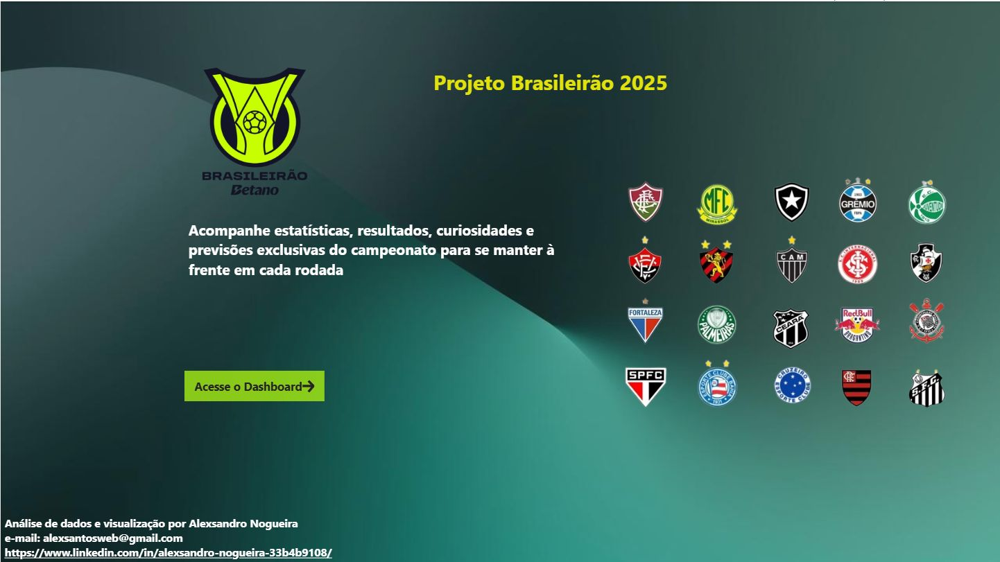
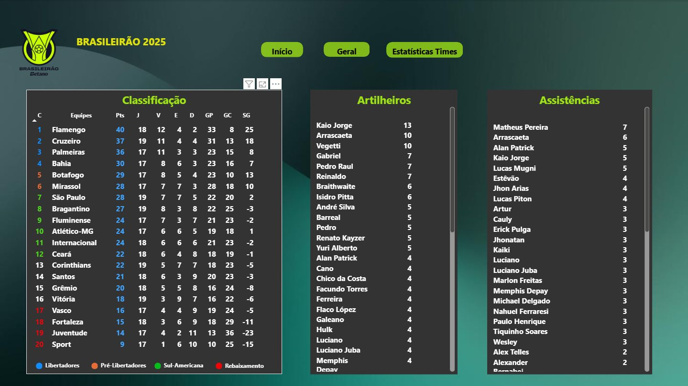
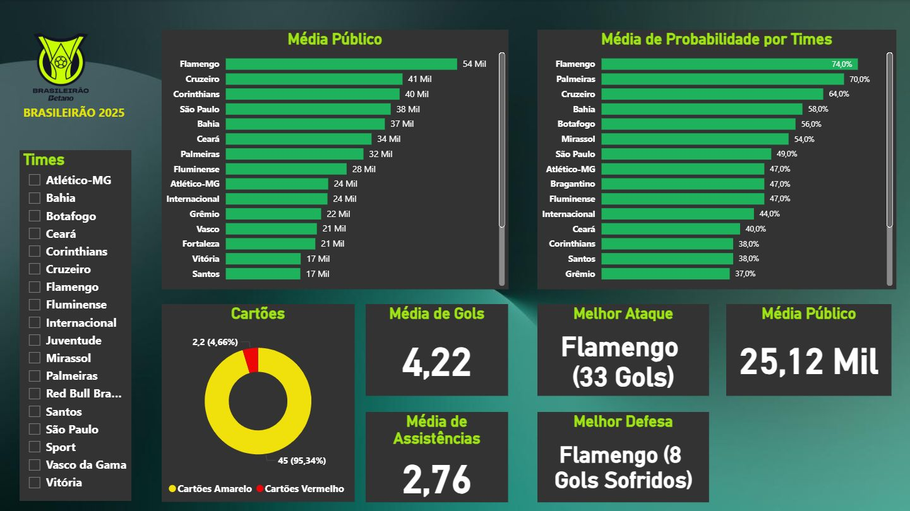

📊 Análise de Dados do Brasileirão 2025 | Power BI, EDA e Modelagem de Dados

🎯 Objetivo do Projeto
Projeto prático focado em Análise de Dados e Business Intelligence, utilizando modelagem de dados, construção de KPIs e visualização estratégica para apoiar tomada de decisão.

📈 Desempenho dos Times e Jogadores
👥 Público e Comportamento dos Torcedores

O objetivo é demonstrar habilidades em Business Intelligence, análise de dados, modelagem e construção de dashboards interativos.

🛠 Tecnologias Utilizadas
- Power BI (Modelagem de dados, DAX e dashboards interativos)
- Excel / CSV (tratamento e organização de dados)
- Análise Exploratória de Dados (EDA)
- Conceitos de ETL
- Estruturação de métricas e KPIs
- Git e GitHub (versionamento de código)

📂 Estrutura do Projeto
Base de dados em CSV contendo:
Classificação dos times
Jogos e resultados
Artilharia
Assistências
Público por partida
Arquivo .pbix com dashboard interativo
Visualizações organizadas por temáticas analíticas

📊 Dashboard – Desempenho dos Times e Jogadores
🎯 Objetivos

Visualização com KPIs de desempenho ofensivo, defensivo e ranking competitivo.

Identificar os times com melhor desempenho ofensivo e defensivo
Avaliar artilheiros e líderes de assistências
Comparar aproveitamento e posição na tabela
Identificar padrões de desempenho ao longo da competição

🔎 Principais Insights
Times com maior número de gols tendem a ocupar o topo da tabela
Alguns jogadores concentram grande parte das participações em gols (gols + assistências)
Existe diferença clara entre desempenho ofensivo e defensivo entre os primeiros colocados e os times da parte inferior
Clubes com maior regularidade apresentam melhor saldo de gols

💡 Valor da Análise
Avaliação de eficiência ofensiva e defensiva
Identificação de dependência excessiva de jogadores-chave
Análise de consistência competitiva

👥 Análise 2: Público e Comportamento dos Torcedores
🎯 Objetivos

Avaliar média de público por rodada
Identificar clubes com maior engajamento
Analisar variação de público conforme desempenho
Comparar jogos com maior presença

🔎 Principais Insights
Clubes com melhor desempenho tendem a manter maior média de público
Jogos decisivos apresentam picos significativos de presença
Alguns clubes mantêm alto público independentemente da posição na tabela
Existe relação entre fase da competição e variação de comparecimento

💡 Valor da Análise
Avaliação de engajamento da torcida
Identificação de padrões comportamentais
Apoio a decisões estratégicas de marketing e gestão esportiva

📊 Dashboard Interativo
O dashboard foi estruturado com:
KPIs estratégicos
Filtros dinâmicos por time
Visualizações comparativas
Rankings de desempenho
Métricas de público

O foco foi garantir clareza visual, navegação intuitiva e suporte à tomada de decisão baseada em dados.

🚀 Competências Demonstradas
Business Intelligence
Power BI
Visualização de Dados
Modelagem de Dados
Construção de KPIs
Análise Exploratória de Dados (EDA)
Storytelling com Dados
Versionamento de código com Git e GitHub
Manipulação de dados em CSV
Construção de métricas orientadas a negócio

🧠 Abordagem Analítica
O projeto seguiu as etapas:
1. Limpeza e organização dos dados
2. Análise exploratória (EDA)
3. Identificação de padrões e correlações
4. Construção de métricas orientadas a negócio
5. Visualização para suporte à decisão

A preocupação principal foi transformar dados brutos em informação acionável.

🔮 Próximos Passos
Automatizar coleta de dados via API
Implementar pipeline de ETL com Python
Migrar estrutura para banco de dados SQL
Evoluir para análises preditivas

👨‍💻 Sobre Mim
Profissional em transição para a área de Dados, com experiência prévia em suporte técnico e foco em resolução analítica de problemas.
Atualmente desenvolvendo projetos práticos com SQL, Python e Power BI, aplicando análise exploratória, modelagem de dados e construção de dashboards estratégicos.

Busco oportunidade como Analista de Dados Jr ou BI Jr para transformar dados em insights que gerem impacto real nas decisões de negócio.
